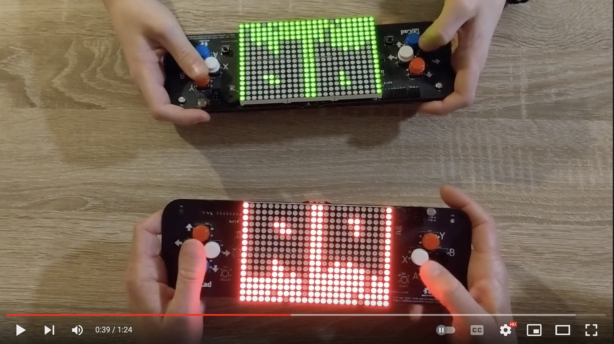

# 8-bit handheld multiplayer gaming device

An Open Source Hardware custom designed handheld gaming device.

* powered by an 8-bit AVR XMEGA microcontroller
* ultra low-res 24x16 monochrome display made of discrete LEDS
* authentic 8-bit retro sound and music
* EEPROM-based hiscores
* multiplayer over bidirectional infrared communication
* battery or USB powered

Project write-up at: https://medium.com/@erikvanzijst/diy-8-bit-handheld-multiplayer-gaming-device-cc30baae7372

