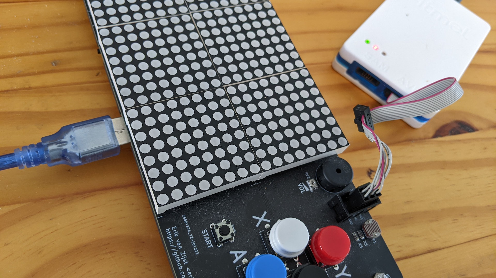
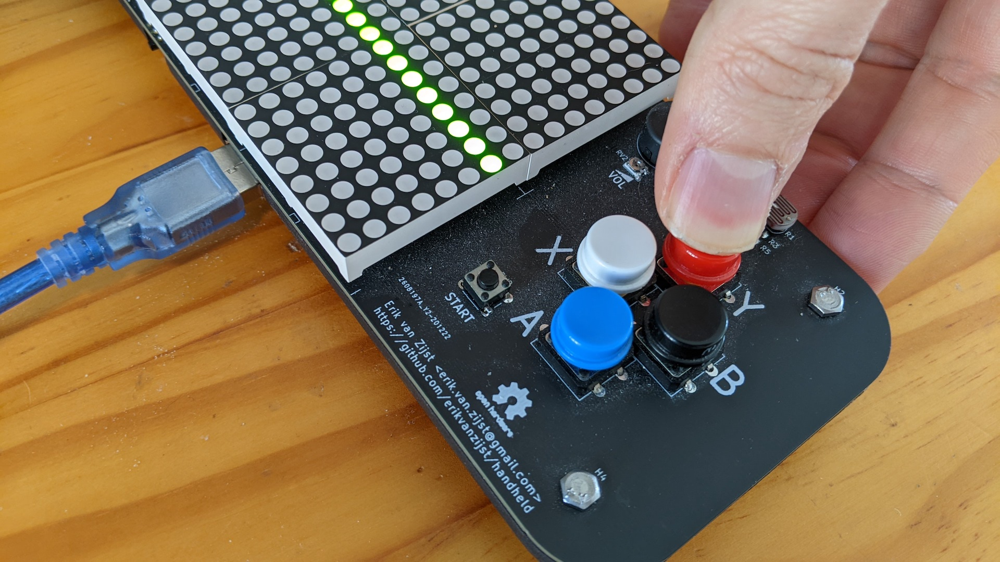

# Firmware for ATxmega256C3

This firmware contains a Tetris implementation with both single player and
multiplayer modes.

Multiplayer uses the board's IrDA transceivers to pit two players against each
other in deathmatch mode where completed lines are added to the opponent's
screen as garbage lines. Multiplayer games are quick with a winner and a
loser.


## Requirements

On OSX, install the AVR compiler toolchain and a DFU programmer:

```
$ xcode-select --install
$ brew tap osx-cross/avr
$ brew install avr-gcc avrdude dfu-programmer
```

For Linux (Ubuntu 20.04):

```
$ sudo apt-get update -y
$ sudo apt-get install -y build-essential git gcc-avr avr-libc avrdude usbutils dfu-programmer
```

# Compiling

Compile the project:

```
$ cd gcc
gcc $ make
...
Finished building target: handheld.elf
"avr-objcopy" -O binary "handheld.elf" "handheld.bin"
"avr-objcopy" -O ihex -R .eeprom -R .fuse -R .lock -R .signature -R .user_signatures \
        "handheld.elf" "handheld.hex"
"avr-objcopy" -j .eeprom --set-section-flags=.eeprom=alloc,load --change-section-lma \
        .eeprom=0 --no-change-warnings -O binary "handheld.elf" \
        "handheld.eep" || exit 0
"avr-objdump" -h -S "handheld.elf" > "handheld.lss"
"avr-size" "handheld.elf"
   text	   data	    bss	    dec	    hex	filename
    812	      0	      0	    812	    32c	handheld.elf
$
```

If this fails and installing the cross compiler toolkit on the host is
problematic, compiling can also be done in Docker.

From the `firmware/` directory, run:

```
$ docker build -t avr:latest -f Dockerfile .
$ docker run --rm -v $PWD:/src avr:latest bash -c "cd /src/gcc && make"
...
Finished building target: handheld.elf
"avr-objcopy" -O binary "handheld.elf" "handheld.bin"
"avr-objcopy" -O ihex -R .eeprom -R .fuse -R .lock -R .signature -R .user_signatures \
        "handheld.elf" "handheld.hex"
"avr-objcopy" -j .eeprom --set-section-flags=.eeprom=alloc,load --change-section-lma \
        .eeprom=0 --no-change-warnings -O binary "handheld.elf" \
        "handheld.eep" || exit 0
"avr-objdump" -h -S "handheld.elf" > "handheld.lss"
"avr-size" "handheld.elf"
   text	   data	    bss	    dec	    hex	filename
  19104	   3342	   1237	  23683	   5c83	handheld.elf

$ ls -l firmware/gcc/handheld.hex 
-rw-r--r--  1 erik  staff  63144 Mar 17 14:13 firmware/gcc/handheld.hex
```


# Programming

## Over PDI with Atmel-ICE

Programming can be done directly over [PDI](https://ww1.microchip.com/downloads/en/Appnotes/doc8282.pdf) with an
[Atmel-ICE](https://www.microchip.com/en-us/development-tool/ATATMEL-ICE) (or compatible) programmer.



Connect the Atmel-ICE programmer with PDI cable and provide power to the
device through a USB cable.

Then turn on the device and run `make flash`:

```
$ cd gcc
gcc $ make flash
Writing flash over Atmel ICE in PDI mode...
avrdude -c atmelice_pdi -p x256c3 -U flash:w:handheld.hex

avrdude: AVR device initialized and ready to accept instructions

Reading | ################################################## | 100% 0.00s

avrdude: Device signature = 0x1e9846 (probably x256a1)
avrdude: NOTE: Programmer supports page erase for Xmega devices.
         Each page will be erased before programming it, but no chip erase is performed.
         To disable page erases, specify the -D option; for a chip-erase, use the -e option.
avrdude: reading input file "handheld.hex"
avrdude: input file handheld.hex auto detected as Intel Hex
avrdude: writing flash (812 bytes):

Writing | ################################################## | 100% 0.04s

avrdude: 812 bytes of flash written
avrdude: verifying flash memory against handheld.hex:
avrdude: load data flash data from input file handheld.hex:
avrdude: input file handheld.hex auto detected as Intel Hex
avrdude: input file handheld.hex contains 812 bytes
avrdude: reading on-chip flash data:

Reading | ################################################## | 100% 0.02s

avrdude: verifying ...
avrdude: 812 bytes of flash verified

avrdude done.  Thank you.
gcc $
```

## Over USB with bootloader

Programming can also be done over USB without an Atmel-ICE. For this to work,
the [bootloader](bootloader/atxmega256c3_104.hex) must first be installed.


### Installing the DFU bootloader

Installing the bootloader is a one-time operation that must be done through PDI
with an Atmel-ICE.

Connect the Atmel-ICE programmer with PDI cable and provide power to the
device through a USB cable.

Then turn on the device and run `make bootloader`:

```
$ cd gcc
gcc $ make bootloader
Installing the bootloader over PDI...
avrdude -c atmelice_pdi -p x256c3 -U flash:w:../bootloader/atxmega256c3_104.hex

avrdude: input file ../bootloader/atxmega256c3_104.hex auto detected as Intel Hex
avrdude: writing flash (267764 bytes):

Writing | ################################################## | 100% 0.00s

avrdude done.  Thank you.
gcc $
```

Once the bootloader is installed, disconnect the Atmel-ICE.


### Entering the bootloader

To enter the bootloader, connect the device to the computer with a USB cable,
then press and hold the device's Y button while switching on the device.



The display likely comes online showing random lines.

Now run `make dfu` to upload the firmware:

```
$ cd gcc
gcc $ make dfu
Erasing flash over USB...
dfu-programmer atxmega256c3 erase
Checking memory from 0x0 to 0x3FFFF...  Empty.
Chip already blank, to force erase use --force.
Writing flash using DFU bootloader over USB...
dfu-programmer atxmega256c3 flash handheld.hex
Checking memory from 0x0 to 0x59FF...  Empty.
0%                            100%  Programming 0x5A00 bytes...
[>>>>>>>>>>>>>>>>>>>>>>>>>>>>>>>>]  Success
0%                            100%  Reading 0x40000 bytes...
[>>>>>>>>>>>>>>>>>>>>>>>>>>>>>>>>]  Success
Validating...  Success
0x5A00 bytes written into 0x40000 bytes memory (8.79%).
dfu-programmer atxmega256c3 launch
gcc $
```

After flashing, the new firmware gets launched automatically.
